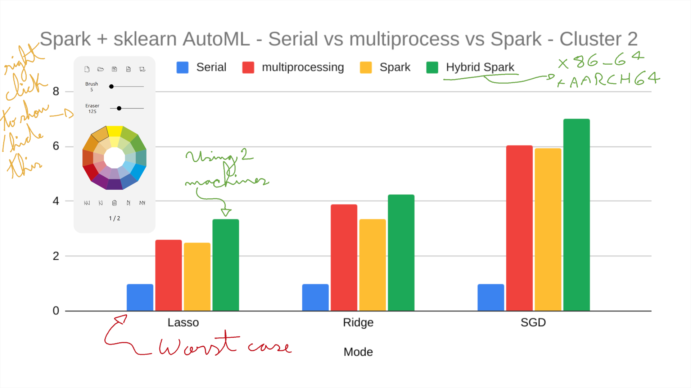

# Description

This is a simple drawing canvas with two working modes, opaque and transparent. They are activated by keyboard shortcuts, work above any application and allow the creation of multiple pages. They can also be used during virtual meetings and presentations. Example screenshot:



# Getting started

## Compile virtualboard

```bash
# Install dependencies
# TODO

# Create a build folder
mkdir build
cd build

# Use qmake to configure dependencies in the project and create the Makefile
qmake ../virtualboard.pro

# Build it
make -j`nproc`
```

## Configure xbindkeys

```bash
# Install xbindkeys
sudo apt install xbindkeys-config xbindkeys -y

# Create a default configuration file in ~/.xbindkeysrc
xbindkeys --defaults > ~/.xbindkeysrc

# Edit the configuration file ~/.xbindkeysrc
vim ~/.xbindkeysrc

# Add the following shortcuts (rows)
"echo showOpaque > /tmp/virtualboard"
  control + F11

"echo showTransparent > /tmp/virtualboard"
  control + F12

# Start xbindkeys (this will display any existing problem in the configuration file)
xbindkeys -n

# OBS.: Another approach to configure xbindkeys is to use the gui
xbindkeys_config
```

## Start them

```bash
# Start virtualboard
./build/virtualboard

# Start xbindkeys
xbindkeys -n
```
